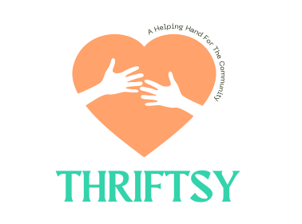

# THRIFTSY
## +Masters Final Project - Code First Girls 


### 📌 TABLE OF CONTENTS

1. Software Summary 🏗 
2. Key Features 🔑
3. System Requirements 🖥️
4. Getting Started 🚀
5. Contributors & Support 👯

----------------------------------------------------

## Software summary 🏗 

Thriftsy is an App that tackles the Current living crisis and reduces wastage by making it easier for people share items with members of their communities. Users can view or add items such as food, clothing, accommodation, appliances and more. The app would use a map API to help users find those in their surrounding area who are willing to give them a helping hand.


## Key Features 🔑

- Create an account and personalise a profile
- Search for items a person requires
- Select & view items
- Upload and list items from camera roll or camera libaray 
- Save your location to your account


## System Requirements  🖥️

1. IDE such as Virtual Studio Code
2. Node.js package manager (npm)
3. Expo 


## Getting Started 🚀

1. Have an IDE & Node.js installed on your computer and Expo on your mobile phone 
2. Download this repository as a .zip file with Thrifty Cook application, save it on your computer
3. Unpack the .zip file on your computer 
5. Open the unpacked folder with Thriftsy application in the IDE 
6. Open a new terminal in your IDE
7. Type the below command to install modules used by Thrifty Cook:
```sh
npm install
```
9. Once the installation of additional modules is finished, type the below command to run the application:
```sh
npm start
```
10. Application is now running, to access it go to Expo on your mobile phone and connect to the localhost running Thriftsy either by scanning the QR code with your phone or connecting to the exp:// address returned in the terminal by typing it in Expo manually.


## The Team‍️ 👯

- [Onyinye Onyekwelu](https://github.com/DocOnyx)
- [Asma Mohamed](https://github.com/asmaaax)
